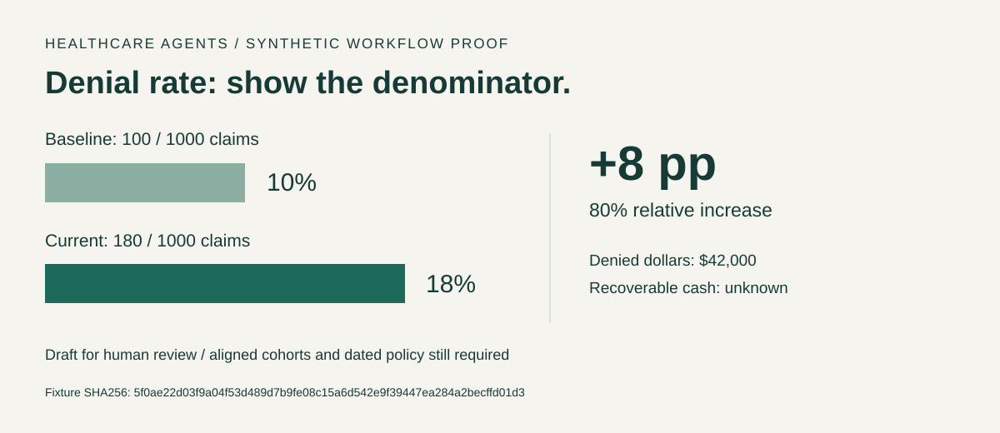
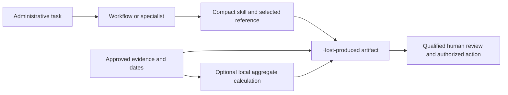

# Healthcare Agents

**Healthcare administration support, from a messy problem to a reviewable artifact.**

This is the **v2.0.0-beta.1 development candidate**. It adds six deep workflows, compact skills, a custom workflow builder and repeatable aggregate calculations. Publication and live-host qualification are pending; `npx healthcare-agents` from the public registry does not yet deliver this candidate.



The picture is generated from [the committed synthetic case](examples/admin-v2/denial-spike-workup.json) and the actual local calculation. These are invented demonstration data, not patient records or measured customer outcomes.

## Start with a task

Use the Healthcare Agents skill in an approved agent environment:

> Investigate the denial-rate increase. Use the supplied aggregate reports, identify evidence gaps, and draft an owner-led recovery plan.

The host model develops the administrative artifact. The local CLI routes tasks, validates workflow contracts and calculates supported aggregate quantities; it does not call a model or execute an operational workflow.

For this checked-out candidate:

```bash
npm ci --ignore-scripts
node bin/cli.js workup "Commercial payer denial rate jumped" --workflow denial-spike-workup --json
node bin/cli.js admin run examples/admin-v2/denial-spike-workup.json
```

Use synthetic or approved aggregate evidence. This package is not a PHI-processing environment and does not make final clinical, legal, coding, billing, audit or compliance authority.

## Six deep workflows

| Task | Useful artifact | Local calculation |
| --- | --- | --- |
| [Denial spike](skills/healthcare-denial-spike-workup/SKILL.md) | Cohort comparison, hypotheses, evidence pulls and recovery owners | Baseline/current rates, percentage points and relative change |
| [Ambulatory access](skills/healthcare-ambulatory-access-backlog/SKILL.md) | Demand/capacity scenario and monitored access plan | Shortfall, net weekly capacity and backlog clearance scenario |
| [Survey evidence](skills/healthcare-survey-readiness-gap-review/SKILL.md) | Standard-to-evidence gap register and retest plan | Missing-evidence counts; no compliance certification |
| [Prior authorization appeal](skills/healthcare-prior-authorization-appeal-workup/SKILL.md) | Source-linked administrative packet and document gap map | Supplied calendar window and missing documents |
| [Underpayment](skills/healthcare-payer-contract-underpayment-review/SKILL.md) | Contract-linked variance register | USD line/net variance, with overpayments retained |
| [Discharge barriers](skills/healthcare-discharge-barrier-workplan/SKILL.md) | Aggregate barrier owners and dependencies | Supplied barrier counts and reported avoidable days |

Each contract contains domain checks, evidence requirements, decisions and an observable completion gate. See [the catalog](workflows/admin-v2/catalog.json) and [case contract](docs/admin-v2/case-contract.md). All six have committed synthetic examples and independently specified expected arithmetic in the regression suite.

The existing **51 specialists and 16 workups** remain available. [Compact role briefs](skills/healthcare-agents/references/roles/) load only the chosen role; detailed original prompts remain optional references. Free-text choose/workup calls offer discovery candidates without selecting a primary specialist or executable workup. The user or host interprets intent, negation, completed work and multiple goals, then supplies validated IDs or a structured selection. Explicit multi-selections retain every workstream. [Routing authority and migration](docs/admin-v2/routing-authority.md) documents the deliberate change from lexical auto-selection; routing scores remain discovery heuristics.

## Specialist coverage

51 specialists across 10 administrative domains remain available on demand.

| Domain | Specialists |
| --- | --- |
| Clinical Operations | 8 |
| Emergency Preparedness | 1 |
| Health IT & Informatics | 6 |
| Operations & Administration | 7 |
| Payer & Managed Care | 6 |
| Pharmacy Programs | 2 |
| Population Health & Community Health | 3 |
| Quality, Safety & Compliance | 7 |
| Revenue Cycle & Finance | 6 |
| Strategy & Advisory | 5 |

## Build your own workflow

Define the outcome, specialist, human owner, evidence fields and acceptance criteria. Use [the example](workflows/admin-v2/custom-example.json) or the [builder skill](skills/healthcare-workflow-builder/SKILL.md).

```bash
node bin/cli.js admin validate workflows/admin-v2/custom-example.json
node bin/cli.js admin build workflows/admin-v2/custom-example.json --output ./community-workflow
```

The new directory contains `SKILL.md`, a detailed reference, a source-attributed case template and a hash manifest. Existing output directories are refused. Custom workflows are instruction packs; the builder does not invent executable formulas, install services or grant external-action authority. A valid contract still needs task-level behavioral evaluation.

## Customer deployment surfaces

```bash
node bin/cli.js admin export codex denial-spike-workup --output ./codex-denials
node bin/cli.js admin export azure denial-spike-workup --output ./azure-denials
```

| Host | Delivered surface | Qualification |
| --- | --- | --- |
| Codex | Skills, portable plugin manifests and local stdio MCP | Actual packaged-server client tests; pinned native MCP campaign receipt separate |
| Claude | Skills and correlated Messages client-tool callback | Local callback/contract tests; live Claude pending |
| ChatGPT | Plugin manifests and local MCP transport | Local protocol/packaging tested; remote web connection pending |
| Azure / Microsoft Foundry | Instructions and Responses function callback | Local bridge tested; SDK/model/tenant deployment pending |
| Databricks | Instructions and Chat Completions callback | Local bridge tested; hosted ResponsesAgent and tenant deployment pending |

```bash
node bin/mcp-server.js --stdio
node bin/host-tool-bridge.js --list azure
```

Eight read-only MCP tools expose catalog discovery, the six validated calculations and an in-memory workflow draft. Strict schemas, provenance, cancellation, deadlines and structured errors apply. [MCP and customer callback guide](docs/platforms/admin-v2-mcp.md) covers plugin launchers, loopback-only HTTP and actual host requirements. The local [Python bridge](adapters/python/host_tools.py) requires Node and installed dependencies. No cloud SDK, credentials or customer-host service is installed by this package.

Existing [installation options](INSTALL.md) and [platform exports](docs/platforms/) remain available. Generated text and installation simulations do not prove acceptance by every current live client.

## Evidence and boundaries

Every v2 numeric input requires an explicit evidence record with source, origin and as-of date. Synthetic and aggregate modes cannot be silently mixed. Missingness and unknown recoverable cash remain explicit. Unexpected fields, invalid dates and impossible denominators fail validation.

Source-family cards in the existing evidence packs are leads to verify, not automatically verified citations. The [bounded primary source review](docs/admin-v2/source-verification.md) records the new workflows' reviewed context and exact applicability limits. Payer terms, standards, deadlines and clinical facts need the applicable exact source and an accountable owner. External submissions, outreach and production changes require scoped authority. A draft or calculated metric does not demonstrate operational completion.



[Trust and safety](docs/trust-and-safety.md) covers approved environments, minimum necessary handling, source freshness and human ownership. Existing [review protocols](docs/review-protocols/README.md) and strict frozen-input contracts remain an optional specialist seam.

## Verify the candidate

```bash
npm run test:admin-v2
npm run test:admin-adapter
npm run test:admin-consumer
npm run test:admin-mcp
npm run test:plugin-consumer
npm run test:routing-intent
npm run test:result-boundary
npm test
```

The new suite tests observable arithmetic, source attribution, missing/contradictory inputs, routing abstention, real CLI file generation and all 30 target/workflow payload combinations. The adapter test exercises all six cases through Python and the actual Node CLI. A separate clean-consumer test installs the npm tarball offline into a disposable project, runs six independent external cases and six provenance failures, resolves payload references from host-style folders, and tests the builder and routing. Release checks retain existing schema, safety, review, installer and package gates.

Offline checks do not measure model quality, customer usefulness or healthcare accuracy. A prior-snapshot [native Codex campaign](docs/admin-v2/model-campaign.md) completed twelve synthetic tasks with actual MCP calls and bounded factual/receipt grading; it was not rerun for the revised routing-authority/result-limit contract and it does not establish clinical certification, general routing reliability, customer outcomes or token savings. [Candidate status](docs/admin-v2/release-status.json) separates local consistency from publication and model/host qualification. Public-channel checks must fail closed when they cannot verify the actual versions.

## Eval Status

Historical records report **51/51 evaluated**, an average **94.18**, and **51/51 tracked improved** under the old rubric. These are **internal prompt-rubric results**, **not certification** or outcome validation. They are retained in [eval/results.tsv](eval/results.tsv); local replay evidence is incomplete. The **remaining eval backlog** includes repeated independent task-level, domain and customer-host evaluation beyond the bounded native Codex campaign.

## Self-Improvement Kit

The historical rubric and role baselines remain immutable. [The existing evaluation procedure](.claude/commands/eval.md) is retained for explicitly requested historical-loop work. New outcome evidence should record task inputs, independent expected facts, exact model/runtime identity, prompts and source hashes, critical errors, human judgments, cost and latency. No superiority claim is made for the compact instructions.

## Maintenance and contributions

Use one versioned release across package, lockfile, plugin and installer. Verify registry and repository payload identity before publication. Keep source-review dates honest; the retained specialist review metadata is not current regulatory verification.

Preserve specialist domain identity, meaningful contracts and owner boundaries. Add realistic negative and conflicting-evidence cases when extending a workflow. Use the [workflow contribution guide](docs/usage/workflow-contribution-guide.md) and report reproducible issues through the repository.

Apache-2.0 · [License](LICENSE) · [Release publishing](docs/release-publishing.md)
