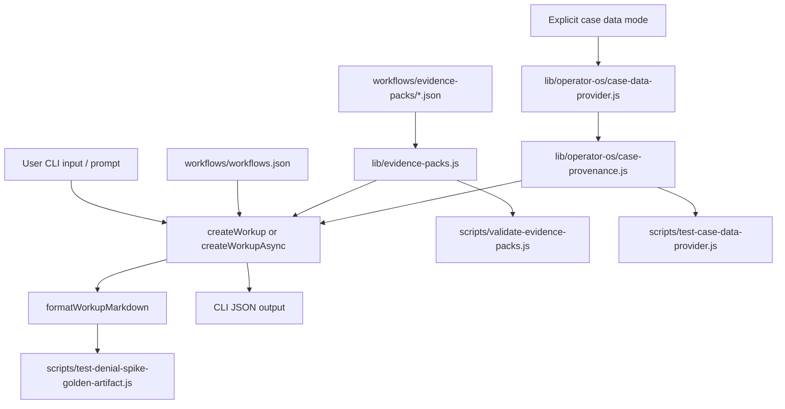

# Operator OS Denial Spike Exemplar Implementation Plan

> **For agentic workers:** REQUIRED SUB-SKILL: Use superpowers:subagent-driven-development (recommended) or superpowers:executing-plans to implement this plan task-by-task. Steps use checkbox (`- [ ]`) syntax for tracking.

**Goal:** Turn `denial-spike-workup` into the first Operator OS flagship workflow by adding offline-first evidence packs, citation cards, mandatory case provenance, optional case-data provider modes, Denial Spike golden artifact validation, CLI/docs support, and a Codex Goals execution loop that can run end to end with subagents and pause only for true external blockers.

**Architecture:** Keep the existing workflow registry stable and layer Operator OS behavior around it. Evidence packs live beside workflows as versioned, offline-first JSON assets. Workup generation attaches pack summaries and optional case data through explicit provider modes. Provenance labels every generated case field as `source_derived`, `synthetic`, or `user_supplied`. Validation scripts make packs, provenance, docs, CLI behavior, package contents, and golden artifact quality part of release readiness.

**Tech Stack:** Node.js scripts and CommonJS modules already used by this repo, strict JSON Schema validation, existing CLI in `bin/cli.js`, existing workflow helpers in `lib/workflows.js`, Beads via `bd`, Codex Goals for long-running orchestration, Codex subagents for bounded research/review/verification.

---

## 1. Execution Contract For Codex Goals

Create the execution Goal with this objective:

```text
Execute the approved Healthcare Agents Operator OS Denial Spike exemplar implementation plan end to end: convert the plan into bd beads, delegate bounded research/review/verification work to subagents, preserve repository workflow rules, implement offline-first evidence packs and citation-card support, add optional case-data provider modes with mandatory provenance, verify acceptance criteria, and prepare PR-ready changes without pushing directly to main.
```

Goal completion requires all of the following:

- `docs/superpowers/plans/2026-05-31-operator-os-denial-spike-exemplar.md` remains the execution source of truth for implementation scope.
- One parent Bead tracks the implementation epic, with child Beads for evidence packs, CLI/workup integration, case data/provenance, golden artifact validation, docs, package safety, and final verification.
- `denial-spike-workup` has an active offline evidence pack with citation cards and validation.
- Workup output can surface evidence-pack context without live network access.
- Optional case-data enrichment is behind explicit provider modes and fails closed when unavailable.
- Every generated case field is labeled with provenance.
- Denial Spike golden artifact checks cover source support, appeal path, root-cause hypotheses, owner handoffs, monitoring, and compliance guardrails.
- Release-readiness checks include the new validators/tests.
- No PHI, secrets, local caches, downloaded evidence payloads, or private payer documents are committed.
- Focused tests and existing release checks pass, or failures are documented with root cause and next action.

Resume checkpoint format:

```text
Goal checkpoint:
- Completed:
- Current Bead:
- Branch:
- Files changed:
- Verification last run:
- Open blockers:
- Next command:
```

Pause and notify Cole only for:

- Need for PHI, customer data, private payer contract text, paid databases, or authenticated payer portals.
- A destructive or hard-to-reverse operation.
- Ambiguous product behavior that changes the public promise materially.
- Conflicting user edits in files needed for the current Bead.
- Verification failure whose root cause is outside the scoped implementation.
- Security/compliance risk that cannot be resolved by narrowing scope.

Do not pause for normal research gaps. Use source-family citation cards and lookup paths until exact sources are locally verified.

---

## 2. Durable Task Graph

Before creating or updating Beads:

```bash
bd-agent-sync pull
bd prime
bd ready -n 100
```

Create one parent epic and child Beads. Use concise titles; the acceptance text below should be copied into the Bead descriptions.

```bash
bd create "Operator OS Denial Spike exemplar implementation" --type epic --priority 1
bd create "Add offline-first evidence pack registry and Denial Spike pack" --type task --priority 1
bd create "Expose evidence packs through CLI and workup output" --type task --priority 1
bd create "Add case-data provider modes and mandatory provenance" --type task --priority 1
bd create "Add Denial Spike golden artifact validation" --type task --priority 1
bd create "Update docs and public positioning for offline-first Operator OS" --type task --priority 2
bd create "Harden package contents and release readiness for evidence assets" --type task --priority 2
bd create "Run final verification and subagent review" --type task --priority 1
```

Attach dependencies so the review Bead depends on all implementation Beads. If an existing Bead already covers a child task, update and claim that Bead instead of duplicating it. Existing Bead `beads-uwc` tracks optional refresh/cache hardening; keep live-fetch refresh work out of the first runtime path unless explicitly scoped.

After Bead changes:

```bash
bd-agent-sync push
```

Parent agent owns all Bead updates, git writes, commits, and PR actions. Subagents do not edit Beads or git state.

---

## 3. Subagent Strategy

Use subagents to keep execution context clean. Pass exact file paths and narrow deliverables.

- Evidence pack researcher: read-only. Deliver source categories, citation-card gaps, and validation edge cases for Denial Spike.
- Domain reviewer: read-only. Use `/home/plumbob/.codex/agents/revenue-cycle-specialist.agent.md`. Review Denial Spike artifact quality and compliance guardrails.
- Implementation scout: read-only. Inspect local code paths before each risky integration Bead and report minimal insertion points.
- Verification agent: read-only or command-only when available. Run focused validators/tests and report failures with root cause.

Use parent-agent implementation for writes unless the runtime exposes a safe write-isolated subagent workflow. Parent must review every subagent result before changing files.

---

## 4. Operator OS Product Rules

Offline-first is the default.

- The app must not require external network access for normal CLI workup generation, tests, docs rendering, or release checks.
- Evidence packs are committed as curated metadata and lookup paths, not as copied proprietary or large downloaded source payloads.
- Live external fetching is a future maintenance action, not a runtime dependency.
- Azure, secure enterprise environments, air-gapped review, and Codex Cloud are first-class deployment assumptions.

Citation cards are mandatory for flagship workflows.

- Cards may use exact citations only when locally verified.
- When exact source text is not verified, cards must name the source family, authority level, lookup path, effective/review date, owner, and red flags.
- Cards must avoid invented page numbers, fake URLs, fabricated policy names, and unsupported billing/legal claims.

Case provenance is mandatory.

- `source_derived`: derived from a named source, citation card, uploaded case file, or user-provided data.
- `synthetic`: generated fixture or simulated case detail for testing/demo.
- `user_supplied`: directly supplied by CLI argument, prompt, uploaded local file, or future UI input.

No case output may imply real patient, payer, provider, or contract facts unless the provenance says where the field came from.

---

## 5. Denial Spike Artifact Standard

The flagship workup should guide users toward an operator-grade artifact with these sections:

- Executive summary: what changed, where, exposure, urgency, and recommended action.
- Spike definition: timeframe, baseline, normalization denominator, lag/remit timing notes, and affected cohorts.
- Exposure analysis: dollars, claim count, days in AR, timely filing risk, expected recoverability, appeal deadlines.
- Segmentation: payer/product, CARC/RARC, service line, location, provider group, claim type, DOS, submission date, remit date.
- Root-cause hypotheses: eligibility/COB, authorization, coding/modifier, medical necessity, claim edit/build, timely filing, payer processing, contract/policy dispute.
- Evidence pull list: 835/remit, 837, claim status, clearinghouse edits, authorization logs, eligibility responses, coding notes, payer policies, contracts, recent workflow/system changes.
- Appeal/escalation strategy: rule basis, deadline, evidence packet, owner, payer contact path, escalation threshold.
- Owner matrix: Revenue Cycle, Denials, Patient Access/Auth, Coding/CDI, Contracting/Payer Relations, Health IT/Data, Compliance/legal as needed.
- Monitoring plan: leading indicators, daily/weekly cadence, hold/release criteria, prevention checks, proof that new denials stopped.

Hostile review checks:

- Does it identify exact CARC/RARC or clearly say the code is missing?
- Is the spike normalized for volume, payer mix, case mix, remit lag, and submission timing?
- Does it distinguish initial denial, final write-off, appeal backlog, and overturn?
- Are dollars split into gross, expected allowed, patient responsibility, write-off, and recovery where data supports it?
- Does the appeal path cite an actual rule, source family, payer policy, contract, or local policy need?
- Are appeal deadlines calculated only when source data exists?
- Are coding/compliance issues escalated instead of overconfidently resolved?
- Does the plan avoid unlawful waiver, cost-share, kickback, miscoding, or unsupported medical-necessity advice?
- Does monitoring prove new denials stopped rather than only describing a cleanup queue?

---

## 6. Target Files

Add:

- `workflows/evidence-packs/schema.json`
- `workflows/evidence-packs/denial-spike-workup.operator-os.v1.json`
- `lib/evidence-packs.js`
- `lib/operator-os/data-modes.js`
- `lib/operator-os/case-provenance.js`
- `lib/operator-os/case-data-provider.js`
- `lib/operator-os/denial-spike-synthetic.js`
- `lib/operator-os/golden-artifacts.js`
- `scripts/validate-evidence-packs.js`
- `scripts/test-evidence-pack-regression.js`
- `scripts/test-case-data-provider.js`
- `scripts/test-denial-spike-golden-artifact.js`

Modify:

- `package.json`
- `bin/cli.js`
- `lib/workflows.js`
- `scripts/release-readiness.sh`
- `scripts/test-cli-regression.js`
- `scripts/validate-packlist.js`
- `README.md`
- `docs/workflows/denial-spike-workup.md`
- `docs/trust-and-safety.md` if it exists; otherwise add a short section to `README.md` instead of creating a broad new policy document.

Do not modify:

- `eval/rubric.md`
- `eval/role-baselines/**`
- `eval/results.tsv` except through the eval workflow, which is out of scope.

---

## 7. Data Flow



---

## 8. Implementation Tasks

### Task 1: Preflight, branch, and Beads

- [ ] Confirm branch is not `main`.

  ```bash
  git status --short
  git branch --show-current
  ```

- [ ] Pull Beads state and inspect ready work.

  ```bash
  bd-agent-sync pull
  bd prime
  bd ready -n 100
  ```

- [ ] Create or update the parent epic and child Beads from section 2.
- [ ] Claim the first implementation Bead by copying the Bead ID printed by `bd create` or `bd ready`.

  ```bash
  bd update beads-uwc --claim
  bd-agent-sync push
  ```

  If `beads-uwc` is no longer the active evidence-pack Bead, run `bd ready -n 100`, choose the child Bead titled `Add offline-first evidence pack registry and Denial Spike pack`, and claim that exact ID.

- [ ] Record the first Goal checkpoint in the thread before edits.

Acceptance:

- Beads reflect this plan without duplicate parallel trackers.
- Work is on a short-lived branch.
- No implementation files changed before Bead state is synced.

### Task 2: Evidence pack registry and Denial Spike pack

- [ ] Add `workflows/evidence-packs/schema.json`.

  Required top-level shape:

  ```json
  {
    "schema_version": "operator-os.evidence-packs.v1",
    "packs": []
  }
  ```

  Pack fields:

  - `id`
  - `workflow_id`
  - `exemplar`
  - `version`
  - `status`
  - `title`
  - `last_reviewed`
  - `offline_first`
  - `phi_policy`
  - `source_categories`
  - `citation_cards`
  - `required_evidence`
  - `failure_modes`
  - `test_prompts`

  Citation card fields:

  - `id`
  - `title`
  - `source_category`
  - `source_family`
  - `authority_level`
  - `citation_text`
  - `last_verified`
  - `effective_date`
  - `offline_locator`
  - `required_fields`
  - `applies_to_sections`
  - `human_owner`
  - `verification_status`
  - `red_flags`

- [ ] Add `workflows/evidence-packs/denial-spike-workup.operator-os.v1.json`.

  Include source categories:

  - `standards`
  - `payer_policy`
  - `cms_regulatory`
  - `contract`
  - `internal_operations`
  - `clearinghouse`
  - `coding_audit`
  - `governance`

  Include cards for at least:

  - CARC/RARC reason-code interpretation.
  - Payer policy or contract lookup.
  - Appeal deadline basis.
  - AR exposure and denial KPI calculation.
  - PHI/minimum necessary handling.
  - 835/837/remit evidence mapping.
  - Authorization/eligibility evidence.
  - Coding/CDI escalation.
  - Contracting/payer-relations escalation.
  - Monitoring and prevention proof.

  Use `source-family-not-pinpoint` or `local-policy-required` where exact source text has not been locally verified. Do not invent exact citations.

- [ ] Add `lib/evidence-packs.js` with these exports:

  ```js
  loadEvidencePackRegistry()
  listEvidencePacks()
  getEvidencePackForWorkflow(workflowId, options)
  summarizeEvidencePack(pack)
  formatEvidencePackMarkdown(pack)
  validateEvidencePackRegistry(registry, workflows)
  ```

- [ ] Add `scripts/validate-evidence-packs.js`.

  Validation rules:

  - Registry and pack JSON parse.
  - Schema version equals `operator-os.evidence-packs.v1`.
  - Every pack `workflow_id` exists in `workflows/workflows.json`.
  - Pack IDs and card IDs are slug-like and unique.
  - Pack versions are semver.
  - Dates are `YYYY-MM-DD`.
  - Active packs are offline-first.
  - Every card category exists in `source_categories`.
  - Every `applies_to_sections` entry matches a workflow `artifact_sections` title or stable normalized title.
  - Verification status is one of `verified-pinpoint`, `source-family-not-pinpoint`, `local-policy-required`, `expired-review`.
  - Active packs have no `expired-review` cards.
  - Denial Spike pack includes the required card coverage listed above.
  - No PHI-like sample values appear in pack JSON.

- [ ] Add package script:

  ```json
  "validate:evidence-packs": "node scripts/validate-evidence-packs.js"
  ```

- [ ] Add `npm run validate:evidence-packs` to `scripts/release-readiness.sh`.

Acceptance:

- `node scripts/validate-evidence-packs.js` passes.
- Evidence pack files are deterministic and do not require network access.
- Denial Spike pack is active, offline-first, and uses honest citation status.

### Task 3: CLI and workup evidence-pack integration

- [ ] Extend `lib/workflows.js` so `createWorkup(problem, options)` can attach an evidence-pack summary when the chosen workflow has one.

  Preserve backward compatibility:

  - Existing callers still work.
  - Existing output fields remain.
  - Evidence pack data is additive under `evidence_pack`.

- [ ] Update `formatWorkupMarkdown(workup)` to add a compact evidence section when `workup.evidence_pack` exists.

  Include:

  - Pack title and version.
  - Last reviewed date.
  - Offline-first status.
  - Citation card titles grouped by source category.
  - Source limitation note when cards are not pinpoint verified.

- [ ] Add CLI command in `bin/cli.js`:

  ```bash
  healthcare-agents evidence-pack list
  healthcare-agents evidence-pack show denial-spike-workup
  healthcare-agents evidence-pack show denial-spike-workup --json
  ```

  Command behavior:

  - `list` prints active packs with workflow id, version, status, last reviewed.
  - `show` prints Markdown summary by default.
  - `--json` prints full pack JSON.
  - Unknown pack exits non-zero with available IDs.

- [ ] Add `scripts/test-evidence-pack-regression.js`.

  Cover:

  - Registry load.
  - Denial Spike pack lookup.
  - Markdown formatting includes citation cards.
  - Unknown workflow returns null or clear error depending on helper.

- [ ] Extend `scripts/test-cli-regression.js`.

  Cover:

  - `evidence-pack list`
  - `evidence-pack show denial-spike-workup`
  - `evidence-pack show denial-spike-workup --json`
  - `workup "denials spiked for payer X"` includes evidence-pack summary.

Acceptance:

- Existing CLI regression tests still pass.
- New evidence-pack CLI tests pass.
- Workup output remains useful in plain text and JSON.

### Task 4: Case-data provider modes and provenance

- [ ] Add `lib/operator-os/data-modes.js`.

  Supported modes:

  - `prompt_only`: no case enrichment beyond user prompt.
  - `synthetic_only`: generated deterministic fixture data only.
  - `public_evidence`: offline evidence-pack metadata only.
  - `public_search`: future explicit refresh/search mode; disabled by default.
  - `hybrid_synthetic_public`: fixture case plus evidence-pack metadata.
  - `internal_private`: future uploaded/private data mode; disabled unless explicit local input is provided.

  Export:

  ```js
  DATA_MODES
  DEFAULT_DATA_MODE
  normalizeDataMode(value)
  isNetworkMode(mode)
  requiresExplicitInput(mode)
  ```

- [ ] Add `lib/operator-os/case-provenance.js`.

  Export:

  ```js
  PROVENANCE_TYPES
  makeProvenance(type, source)
  labelField(value, provenance)
  labelObjectFields(object, provenanceByField)
  assertAllFieldsProvenanced(object)
  summarizeProvenance(labeledObject)
  stripProvenance(labeledObject)
  ```

  Rules:

  - Valid types are `source_derived`, `synthetic`, and `user_supplied`.
  - `source_derived` requires a source id or citation card id.
  - `user_supplied` requires a field source such as `cli.problem`.
  - Assertion fails if any generated case field lacks provenance.

- [ ] Add `lib/operator-os/denial-spike-synthetic.js`.

  Export:

  ```js
  buildSyntheticDenialSpikeCase(options)
  ```

  Fixture fields:

  - `payer`
  - `product`
  - `timeframe`
  - `baseline_denial_rate`
  - `current_denial_rate`
  - `claim_count`
  - `gross_charges_at_risk`
  - `dominant_carc_rarc`
  - `service_lines`
  - `suspected_root_causes`
  - `evidence_available`
  - `appeal_deadline_basis`
  - `recommended_owners`

  Every field must be labeled `synthetic`.

- [ ] Add `lib/operator-os/case-data-provider.js`.

  Export:

  ```js
  createCaseDataProvider(options)
  getCaseDataForWorkflow(workflowId, prompt, options)
  formatCaseDataMarkdown(caseData)
  ```

  Behavior:

  - Default mode is `prompt_only`.
  - No provider performs network access unless mode is `public_search` and a future explicit option enables it.
  - `internal_private` returns a clear unsupported/missing-input result until local upload parsing exists.
  - Unsupported modes fail closed.
  - Denial Spike synthetic modes return provenance-labeled fixture case data.

- [ ] Add `createWorkupAsync(problem, options)` to `lib/workflows.js`.

  Behavior:

  - Calls existing `createWorkup`.
  - Attaches evidence pack.
  - Attaches optional case data when `options.dataMode` requests it.
  - Leaves `createWorkup` synchronous for existing callers.

- [ ] Update `bin/cli.js` so `workup` can accept:

  ```bash
  healthcare-agents workup "denial spike" --data-mode synthetic_only
  healthcare-agents workup "denial spike" --data-mode hybrid_synthetic_public --json
  ```

  If async dispatch is needed, wrap command dispatch in an async `main()` and preserve exit behavior.

- [ ] Add `scripts/test-case-data-provider.js`.

  Cover:

  - Default mode is prompt-only.
  - Synthetic Denial Spike case has all fields provenanced.
  - `assertAllFieldsProvenanced` fails on unlabeled fields.
  - Unsupported or network modes fail closed.
  - Workup async output includes case-data summary only when requested.

Acceptance:

- `node scripts/test-case-data-provider.js` passes.
- Existing sync helper remains available.
- No default path fetches live external data.
- Every generated case field carries provenance.

### Task 5: Denial Spike golden artifact validation

- [ ] Add `lib/operator-os/golden-artifacts.js`.

  Export:

  ```js
  buildDenialSpikeGoldenArtifact(workup, options)
  scoreDenialSpikeArtifact(markdownOrObject)
  assertDenialSpikeGoldenArtifact(markdownOrObject)
  ```

  Scoring dimensions:

  - Spike definition and normalization.
  - CARC/RARC specificity or explicit missing-data callout.
  - AR exposure and appeal timing.
  - Root-cause hypotheses.
  - Evidence pull list.
  - Citation-card/source-family support.
  - Owner matrix.
  - Monitoring/prevention plan.
  - Compliance and PHI guardrails.
  - Avoidance of unsupported billing/legal advice.

- [ ] Add `scripts/test-denial-spike-golden-artifact.js`.

  Cover:

  - Synthetic Denial Spike workup builds a passing golden artifact.
  - Removing CARC/RARC support fails.
  - Removing citation/source support fails.
  - Removing monitoring plan fails.
  - Adding PHI-like fake patient detail fails.

- [ ] Decide whether the golden artifact is only a test fixture or also a user-facing CLI command.

  Default: test fixture only for first PR. Add CLI only if it falls out cleanly from existing command patterns.

Acceptance:

- Golden artifact test passes.
- The test fails for meaningful omissions.
- The artifact quality bar matches the Denial Spike standard in section 5.

### Task 6: Package safety and release readiness

- [ ] Update `scripts/validate-packlist.js`.

  Required entries:

  - `workflows/evidence-packs/schema.json`
  - `workflows/evidence-packs/denial-spike-workup.operator-os.v1.json`
  - `lib/evidence-packs.js`
  - `lib/operator-os/data-modes.js`
  - `lib/operator-os/case-provenance.js`
  - `lib/operator-os/case-data-provider.js`
  - `lib/operator-os/denial-spike-synthetic.js`
  - `lib/operator-os/golden-artifacts.js`

  Forbidden patterns:

  - Local cache directories.
  - Downloaded source payloads.
  - Private payer documents.
  - PHI-like sample files.
  - Run logs.

- [ ] Update `package.json` scripts:

  ```json
  "test:evidence-packs": "node scripts/test-evidence-pack-regression.js",
  "test:case-data-provider": "node scripts/test-case-data-provider.js",
  "test:denial-spike-golden": "node scripts/test-denial-spike-golden-artifact.js"
  ```

- [ ] Add the new validators/tests to `scripts/release-readiness.sh`.

Acceptance:

- Package validation includes new shipped files.
- Release readiness runs new checks.
- Packlist excludes private, generated, or downloaded evidence payloads.

### Task 7: Docs and positioning

- [ ] Update `docs/workflows/denial-spike-workup.md`.

  Add:

  - Offline-first evidence-pack behavior.
  - Citation-card expectations.
  - Case provenance explanation.
  - Supported data modes.
  - Denial Spike artifact standard.
  - Example CLI commands.
  - Secure environment note: no live fetch required for default usage.

- [ ] Update `README.md`.

  Add a short Operator OS flagship note:

  - Denial Spike is the first exemplar.
  - Evidence packs are versioned and offline-first.
  - Live evidence refresh/search is optional future maintenance, not runtime dependency.
  - Case data is explicit-mode only and provenance-labeled.

- [ ] Update `docs/trust-and-safety.md` if it exists.

  Add:

  - No PHI in fixtures or evidence packs.
  - Source-family citations are used when exact citation text is not verified.
  - Human review is required for payer-specific contracts, policy interpretation, appeals, and legal/compliance decisions.

Acceptance:

- Docs align with actual CLI behavior.
- Docs do not overpromise live research, autonomous appeals, or verified payer-specific policy coverage.
- No marketing copy suggests the tool replaces human revenue-cycle, coding, compliance, or legal review.

### Task 8: Verification

Run focused checks first:

```bash
node scripts/validate-evidence-packs.js
node scripts/test-evidence-pack-regression.js
node scripts/test-case-data-provider.js
node scripts/test-denial-spike-golden-artifact.js
node scripts/test-cli-regression.js
node scripts/validate-packlist.js
```

Then run release readiness:

```bash
npm run release:check
```

If `npm run release:check` fails:

- Identify the failing command.
- Fix implementation-owned failures.
- If failure is environmental or outside scope, document exact output and next action in the Goal checkpoint.

Acceptance:

- Focused tests pass.
- Release readiness passes or has a documented external blocker.
- No command requires network access for default validation.

### Task 9: Subagent review

Dispatch at least two read-only reviews before finalizing:

- Revenue-cycle domain review using `/home/plumbob/.codex/agents/revenue-cycle-specialist.agent.md`.
- Implementation/security review focused on offline-first guarantees, provenance, package contents, and CLI behavior.

Review prompts should include:

- Branch name.
- Changed files.
- The Denial Spike artifact standard from section 5.
- Commands already run.
- Explicit instruction to report only actionable defects and missing tests.

Acceptance:

- Actionable review findings are fixed or documented.
- Parent agent reruns affected tests after fixes.

### Task 10: Commit, PR, and handoff

- [ ] Inspect final diff.

  ```bash
  git status --short
  git diff --stat
  git diff --check
  ```

- [ ] Close completed Beads with evidence. Use the exact Bead IDs from `bd list --json`; close each child only after its acceptance checks pass.

  ```bash
  bd close beads-uwc --reason "Implemented offline-first evidence pack scope and verified with node scripts/validate-evidence-packs.js, node scripts/test-evidence-pack-regression.js, node scripts/test-cli-regression.js, and npm run release:check"
  bd-agent-sync push
  ```

  Repeat for the remaining implementation child Beads using the exact verification commands run for each Bead.

- [ ] Commit on the feature branch. Stage the actual changed paths shown by `git status --short`; do not stage unrelated user edits.

  ```bash
  git add workflows/evidence-packs/schema.json workflows/evidence-packs/denial-spike-workup.operator-os.v1.json lib/evidence-packs.js lib/operator-os/data-modes.js lib/operator-os/case-provenance.js lib/operator-os/case-data-provider.js lib/operator-os/denial-spike-synthetic.js lib/operator-os/golden-artifacts.js scripts/validate-evidence-packs.js scripts/test-evidence-pack-regression.js scripts/test-case-data-provider.js scripts/test-denial-spike-golden-artifact.js package.json bin/cli.js lib/workflows.js scripts/release-readiness.sh scripts/test-cli-regression.js scripts/validate-packlist.js README.md docs/workflows/denial-spike-workup.md docs/superpowers/plans/2026-05-31-operator-os-denial-spike-exemplar.md .beads/issues.jsonl
  git commit -m "Add Operator OS Denial Spike evidence packs"
  ```

- [ ] Push branch and open PR only when requested or when following repo-local workflow for requested edits. Replace `codex/operator-os-implementation-plan` only if implementation continued on a newer feature branch.

  ```bash
  git push -u origin codex/operator-os-implementation-plan
  gh pr create --title "Add Operator OS Denial Spike evidence packs" --body-file /tmp/operator-os-denial-spike-pr.md
  ```

PR body template:

```markdown
## Summary
- Adds offline-first evidence pack registry and Denial Spike citation cards.
- Adds explicit case-data modes with mandatory provenance.
- Adds Denial Spike golden artifact validation and release-readiness checks.
- Updates CLI/docs for secure-environment usage without runtime live fetches.

## Verification
- node scripts/validate-evidence-packs.js
- node scripts/test-evidence-pack-regression.js
- node scripts/test-case-data-provider.js
- node scripts/test-denial-spike-golden-artifact.js
- node scripts/test-cli-regression.js
- node scripts/validate-packlist.js
- npm run release:check

## Safety
- No PHI fixtures or private payer documents committed.
- Default runtime is offline-first.
- Live external fetching is not required for normal use.
- Case data is explicit-mode only and provenance-labeled.
```

Acceptance:

- Final branch is PR-ready.
- Beads are synced.
- Goal is marked complete only after verification and handoff are done.

---

## 9. Review Checklist

Before claiming completion, verify:

- [ ] `denial-spike-workup` remains valid under `workflows/schema.json`.
- [ ] Evidence pack validation fails on bad workflow IDs, bad dates, bad card categories, missing Denial Spike required coverage, expired active cards, and PHI-like samples.
- [ ] CLI unknown-pack behavior is non-zero and helpful.
- [ ] `workup` remains backward compatible for existing callers and tests.
- [ ] Default workup does not use network access.
- [ ] `public_search` and `internal_private` fail closed until explicitly implemented.
- [ ] Synthetic case fields are all provenance-labeled.
- [ ] Markdown output is concise enough for CLI use.
- [ ] Docs accurately distinguish verified pinpoint citations from source-family lookup cards.
- [ ] Package validation prevents local caches, run logs, private documents, and PHI-like files from shipping.
- [ ] Release readiness includes all new validators/tests.

---

## 10. Plan Self-Review

This plan intentionally separates durable execution state from runtime context:

- Codex Goals provide the long-running objective, checkpoints, pause rules, and final completion gate.
- Beads provide the durable task graph and repo-local handoff state.
- Subagents provide bounded research/review/verification without owning repo state.
- Evidence packs provide offline, versioned source guidance for secure environments.
- Citation cards avoid hallucinated specificity by allowing source-family status when pinpoint verification is not available.
- Case provenance makes generated fixtures and user-supplied facts auditable.

Known deferred work:

- Automated live evidence refresh, cache invalidation, and external search ingestion remain future maintenance scope under `beads-uwc`.
- MCP integration remains optional. The provider boundary should make a future MCP adapter possible without requiring MCP for secure default usage.
- Private payer contract parsing and PHI-bearing internal data ingestion require a separate security and compliance design before implementation.

---

## 11. Execution Options

Recommended next action:

1. Start the implementation Goal with the objective in section 1.
2. Convert section 8 tasks into Beads using section 2.
3. Implement Task 2 first because it creates the offline evidence contract that later CLI, provenance, docs, and validation work depend on.

Alternative:

Start with Task 4 if the product priority is proving provenance before evidence-pack UX. This is technically safe, but it delays the visible Operator OS flagship behavior.
